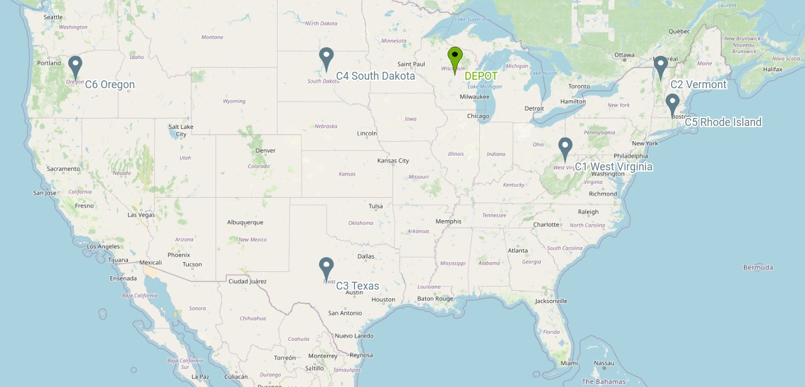
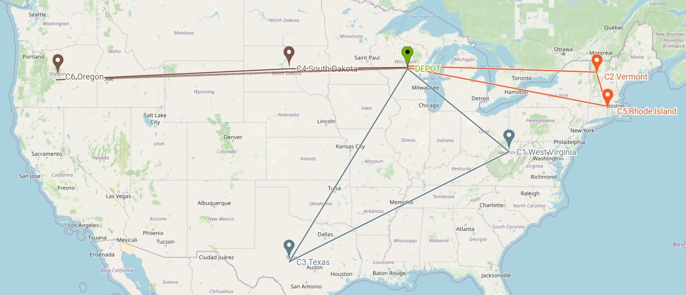

Example
======================================

We will show you how to modelise a simple optimization routing problem by using VRPSolverEasy.

Data
------------------

In this example, the objective is to minimize the total cost of route 
such that each customers is served within their time windows and the total demand handled by each truck does not exceed its capacity.
The distance between points distances were calculated using the Euclidean norm and the time 
between points correspond to the distance.

.. code-block:: python
   :emphasize-lines: 4,5

    # data
    cost_per_time = 10
    cost_per_distance = 10
    begin_time = 0
    end_time = 5000
    nb_point = 7

    # map with names and coordinates
    coordinates = {"Wisconsin, USA": (44.50, -89.50),  # depot
                   "West Virginia, USA": (39.000000, -80.500000),
                   "Vermont, USA": (44.000000, -72.699997),
                   "Texas, the USA": (31.000000, -100.000000),
                   "South Dakota, the US": (44.500000, -100.000000),
                   "Rhode Island, the US": (41.742325, -71.742332),
                   "Oregon, the US": (44.000000, -120.500000)
                   }

    # demands of points
    demands = [0, 500, 300, 600, 658, 741, 436]

In this example, we resolve a very simple **CVRPTW** with the same time windows.

Mathematical linear forumulation CVRPTW
---------------------------------------
We suppose that we work in a directed graph.

Sets
*****

    :math:`N` : Set of points  (Customer :math:`i \in {1..n}`, Depot :math:`i=0,n+1`)
    
    :math:`K` : Set of vehicles

    :math:`E` : Set of links 

    :math:`\xi^{+}_i\ :` Outgoing arcs from point i

    :math:`\xi^{-}_i\ :` Incoming arcs from point i 

Parameters
**********

    :math:`d_i` : Demand at point :math:`i \in {1..n}` 

    :math:`C_k` : Capacity of vehicle :math:`k \in K`

    :math:`twb_i` : Time windows begin of point i :math:`i \in N`

    :math:`twe_i` : Time windows end of point i :math:`i \in N`

    :math:`s_i` : Service time at point i :math:`i \in N`

    :math:`t_{ij}` : Travel time from i to j  :math:`(i,j) \in N`

    :math:`c_{ij}` : Total cost from i to j  :math:`(i,j) \in N`

    :math:`M` : Very large positive number (Big M)

Variables
**********

    :math:`x_{ijk} =  \begin{cases}
    1  &\text{if link (i,j) is used by vehicle k}\\
    0  &\text{otherwise}\end{cases}`

    :math:`a_{ik} = \text{Arrival time at point i by vehicle k} \in \mathbb{R}`

Model
**********
    Min :math:`\sum \limits_{\{i,j\} \in E} \sum \limits_{k \in K} (c_{ij} \times x_{ijk})` 

    :math:`\sum \limits_{j \in N\backslash\{0,n+1\} }  x_{0jk} = 1 \hspace{1cm} \forall k \in K`  
    
    :math:`\sum \limits_{i \in N\backslash\{0,n+1\} }  x_{i,n+1,k} = 1 \hspace{1cm} \forall k \in K`
    
    :math:`\sum \limits_{k \in K\ } \sum \limits_{j \in \xi^{+}_i\ }  x_{ijk} = 1 \hspace{1cm} \forall i \in N`

    :math:`\sum \limits_{k \in K\ } \sum \limits_{i \in \xi^{-}_j\ }  x_{ijk} = 1 \hspace{1cm} \forall i \in N`

    :math:`\sum \limits_{j \in \xi^{+}_i\ }  x_{ijk} - \sum \limits_{j \in \xi^{-}_j } x_{ijk} = 0 \hspace{1cm} \forall i \in N,\forall k \in K`

    :math:`\sum \limits_{(i,j) \in E\ }  d_{i} \times x_{ijk} \leq C_{k} \hspace{1cm} \forall k \in K`

    :math:`w_{jk}-w_{ik}-s_{i}-t_{ij} + M(1-x_{ijk}) \geq 0 \hspace{1cm} \forall (i,j) \in E , k \in K`

    :math:`w_{ik}  \geq twb_{i}\hspace{1cm} \forall i \in N,\forall k \in K`

    :math:`w_{ik} + s_{i}  \leq twe_{i}\hspace{1cm} \forall i \in N,\forall k \in K`

    :math:`x_{ijk} \in \{0,1\} \forall (i,j) \in E,\forall k \in K`

    :math:`w_{ik} \in \mathbb{R} \hspace{1cm} \forall i \in N,\forall k \in K`

Model VRPSolverEasy
---------------------

.. code-block:: python

    # Initialisation
    model = solver.CreateModel()

    # Add vehicle type
    model.add_vehicle_type(
        id=1,
        start_point_id=0,
        end_point_id=0,
        name="VEH1",
        capacity=1100,
        max_number=6,
        var_cost_dist=cost_per_distance,
        var_cost_time=cost_per_time,
        tw_end=5000)

    # Add depot
    model.add_depot(id=0, name="D1", tw_begin=0, tw_end=5000)

    coordinates_keys = list(coordinates.keys())
    # Add Customers
    for i in range(1, nb_point):
        model.add_customer(
            id=i,
            name=coordinates_keys[i],
            demand=demands[i],
            tw_begin=begin_time,
            tw_end=end_time)

    # Add links
    coordinates_values = list(coordinates.values())
    enumerate = 1
    for i in range(0, 7):
        for j in range(i + 1, 7):
            dist = compute_euclidean_distance(coordinates_values[i][0],
                                              coordinates_values[j][0],
                                              coordinates_values[i][1],
                                              coordinates_values[j][1])
            model.add_link(
                "arc" + str(enumerate),
                start_point_id=i,
                end_point_id=j,
                distance=dist,
                time=dist)
            enumerate += 1

 

Results
------------------

After the resolution, you can use the routes of vehicles in :

.. code-block:: python

    model.solution

You can read the API page for more informations.