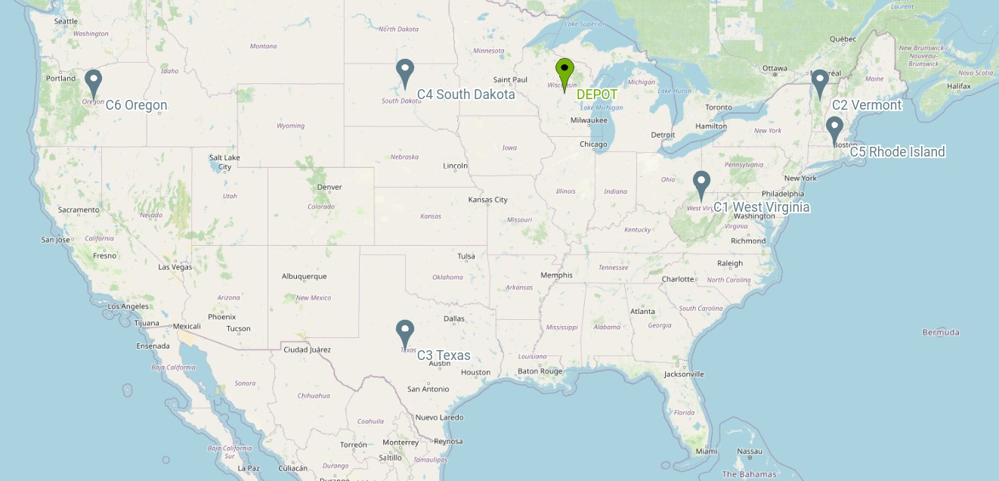

Example
======================================

We will show you how to modelise a simple optimization routing problem by using VRPSolverEasy.

Data
------------------

In this example, the objective is to minimize the total cost of a route 
such that each customer is served within their time windows and the total demand handled by each truck does not exceed its capacity.
The distance between points were calculated using the Euclidean norm and the time 
between points corresponds to the distance.

.. code-block:: python
   :emphasize-lines: 4,5

    # data
    cost_per_time = 10
    cost_per_distance = 10
    begin_time = 0
    end_time = 5000
    nb_point = 7

    # map with names and coordinates
    coordinates = {"Wisconsin, USA": (44.50, -89.50),  # depot
                   "West Virginia, USA": (39.000000, -80.500000),
                   "Vermont, USA": (44.000000, -72.699997),
                   "Texas, the USA": (31.000000, -100.000000),
                   "South Dakota, the US": (44.500000, -100.000000),
                   "Rhode Island, the US": (41.742325, -71.742332),
                   "Oregon, the US": (44.000000, -120.500000)
                   }

    # demands of points
    demands = [0, 500, 300, 600, 658, 741, 436]

In this example, we resolve a very simple **CVRPTW** with the same time windows.

Model VRPSolverEasy
---------------------

.. code-block:: python

    # Initialisation
    model = solver.Model()

    # Add vehicle type
    model.add_vehicle_type(
        id=1,
        start_point_id=0,
        end_point_id=0,
        name="VEH1",
        capacity=1100,
        max_number=6,
        var_cost_dist=cost_per_distance,
        var_cost_time=cost_per_time,
        tw_end=5000)

    # Add depot
    model.add_depot(id=0, name="D1", tw_begin=0, tw_end=5000)

    coordinates_keys = list(coordinates.keys())
    # Add Customers
    for i in range(1, nb_point):
        model.add_customer(
            id=i,
            name=coordinates_keys[i],
            demand=demands[i],
            tw_begin=begin_time,
            tw_end=end_time)

    # Add links
    coordinates_values = list(coordinates.values())
    enumerate = 1
    for i in range(0, 7):
        for j in range(i + 1, 7):
            dist = compute_euclidean_distance(coordinates_values[i][0],
                                              coordinates_values[j][0],
                                              coordinates_values[i][1],
                                              coordinates_values[j][1])
            model.add_link(
                "arc" + str(enumerate),
                start_point_id=i,
                end_point_id=j,
                distance=dist,
                time=dist)
            enumerate += 1

 

Results
------------------

.. image:: Pictures/Results.jpg

After the resolution, you can use the routes of vehicles in :

.. code-block:: python

    model.solution

You can read the API page for more informations.
